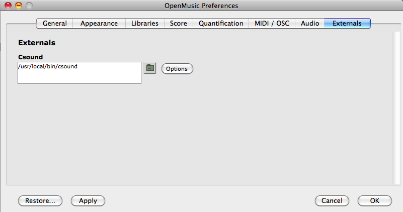

# Foreword 

## Before starting

Get the latest version of [OpenMusic](https://github.com/openmusic-project/OM6/releases) and the [OM2Csound](https://github.com/openmusic-project/OM2Csound/releases) and [OMChroma](https://github.com/openmusic-project/OMChroma/releases) library installed on your computer.

See the OM User Manual for [instructions on how to install libraries](http://support.ircam.fr/docs/om/om6-manual/co/UserLibraries.html). Or [here](Load).

If you do not have a running version of [Csound](https://csound.com/download.html), download and install one. When the installation is complete, you should have an executable version of csound in /usr/local/bin. 

Once the OM2Csound library is loaded in OM, you might be able to check the Csound installation and path from the OM / Externals preferences tab:

## Entry requirements

This manual will assume the reader has a good knowledge of OpenMusic and knows how to manage the OM Workspace. For any problems with OpenMusic consult the [OM User Manual](http://support.ircam.fr/docs/om/om6-manual/).

Some knowledge of Csound may also be useful (see [below](#csound)).

## Audio settings

A number of option in the OpenMusic/Audio preferences might be useful to set before using OMChroma:

- **Default Audio Format**: choose between AIFF and WAVE.

- **Default Resolution**: set the bit resolution of the sound file.

- **If Output File Exists**: 2 options
  - **Auto Rename** will add a number to the file name, so that each time a sound with the same name is synthesized, the old one will not be overwritten. Beware: this option might fill up your sound file folder very rapidly! 
  - **Replace** will overwrite sound files with the same name.

- **Delete Temporary Files**: if checked, temporary files (orchestra, score and the temporary sythesis outputs) will be deleted after the synthesis process has ended. Unckech mostly for debgging purpose.

- **Normalize Output (default)**: if checked, normalize the sound (the synthesis is floating point). The normalization can also be specified locally as a keyword (rescale) of OMChroma's **synthesize** function.

- **Use**: Allows to chose a system for normalization. Level is the maximum level [dB] after normalization (0=full level, digital). Use rather -3 or -6.

- **Print System Outputs**: if checked (recommended for debugging purpose), the output of Csound will be redirected to the OM Listener, otherwise it will be visible only in system Console windows.

## Csound

Csound is a sound design, music synthesis and signal processing system with a toolkit of over 500 signal processing modules (called _opcodes_). It provides facilities for composition and performance over a wide range of platforms. Before starting with OMChroma you'll need to understand the structure and syntax of the Csound's language.

A Csound program works with two complementary text-based files, the orchestra file (extension .orc) and the score file (extension .sco). These files constitute the Csound Orchestra and Score. They can also be gathered as separate sections of a single Csound file (extension .csd).

The Csound **orchestra** consists of two parts : the header section and the instrument section. The header section contains the audio rate, the control rate and the number of output channels. The instrument section contains the instruments, which are designed by interconnecting opcodes that either generate or modify signals. It is in an instrument that a Digital Signal Processing algorithm is implemented.

The Csound **score** consists of three parts : tables, notes and other information.

The tables are generated by mathematical function-drawing subroutines (GEN routines or f-statements). They are not requested by all of the orchestra's opcodes (modules), and are therefore not always necessary.

The notes or i-statements pass the performance parameters (P-fields) to the instrument of the orchestra following their action-time.

Other information contains, for instance, the tempo statement (or t-statement), which allows the specification of a tempo map. By default, all the temporal data are expressed in beats with a metronome of 60 to the crotchet (hence pulse = absolute time).

See more detailed information on [http://www.csounds.com/resources/documentation/](http://www.csounds.com/resources/documentation/)
