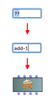

# Getting Started

Once the OMChroma library is loaded, you can add a synthesis object in your OpenMusic patches (see the [different ways to add boxes in a patch](http://support.ircam.fr/docs/om/om6-manual/co/AddingBoxes.html)).

**The most basic object to start with is the ADD-1 class:**

The following steps allow you to test the basic synthesis functionality.
Alternatively, open and test with teh patch **sc-01 audio test** in he OMChroma tutorials (see [below](#Tutorials)).

# Tutorials

From the OpenMusic workspace window's menu, select: `Help/Import Tutorials Patches/Libraries/OMChroma

The folder omchroma-tutorial-patches should be now in your workspace window.

