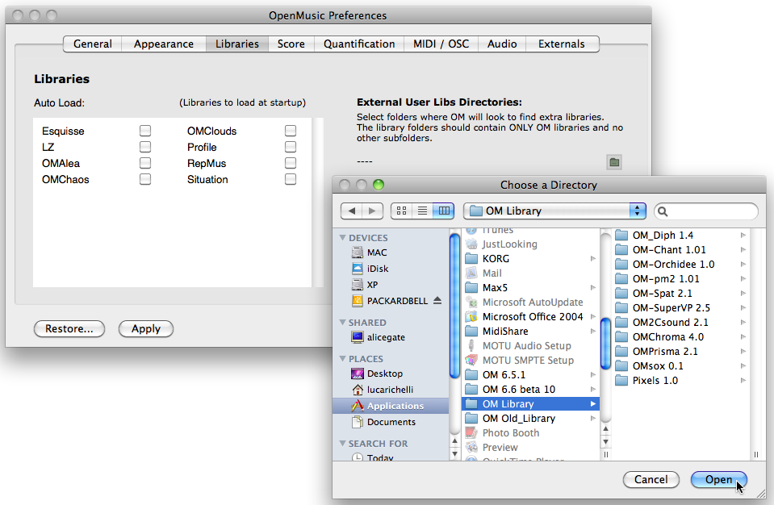
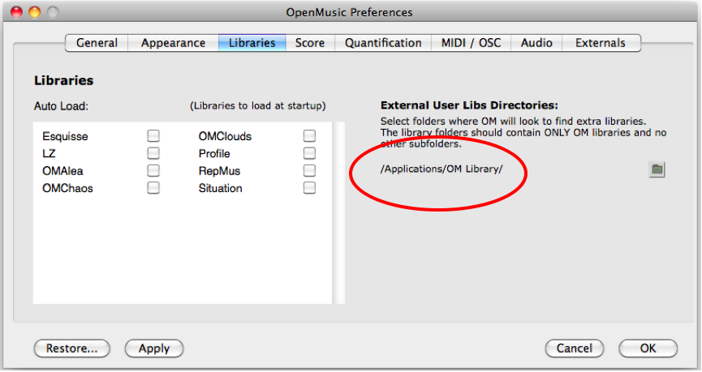
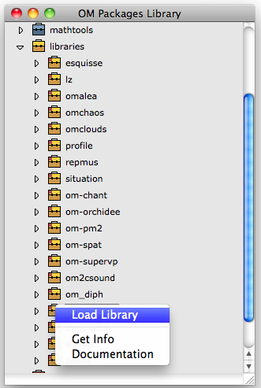
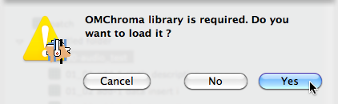

# Load the library

The **OMChorma** and **OM2Csound** libraries must be unpacked and installed in one of the specified external folders.

Set the library folder in teh OM / Libraries tab folder if necessary, push "Apply" to record the change.

**Note:** At this point your library is registered in the OM libraries, not yet **loaded**.

Open the Library Window in OM (shift + cmd + P), open the library folder and load the OMChroma library.
	

If you did not load the OMChroma library and open a patch requiring it, a window will appear proposing you to load the library (if available). Answer yes to this window.

