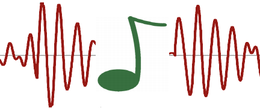

OMChroma is an OpenMusic library for the high-level control of sound synthesis with Csound.
The library contains a set of classes corresponding to numerous synthesis processes and Csound orchestras to be parameterized and controlled in OpenMusic.

<!--  -->

------

### User Manual Sections

- [Foreword / System Configuration](Config)
- [Load the library](Load)
- [Getting Started](GettingStarted)

------
... the rest of the user maunal is still [here](http://support.ircam.fr/docs/om-libraries/omchroma/)

------
Contributors: Luca Richelli, Marco Stroppa, Jean Bresson, Marco Bidin. 
